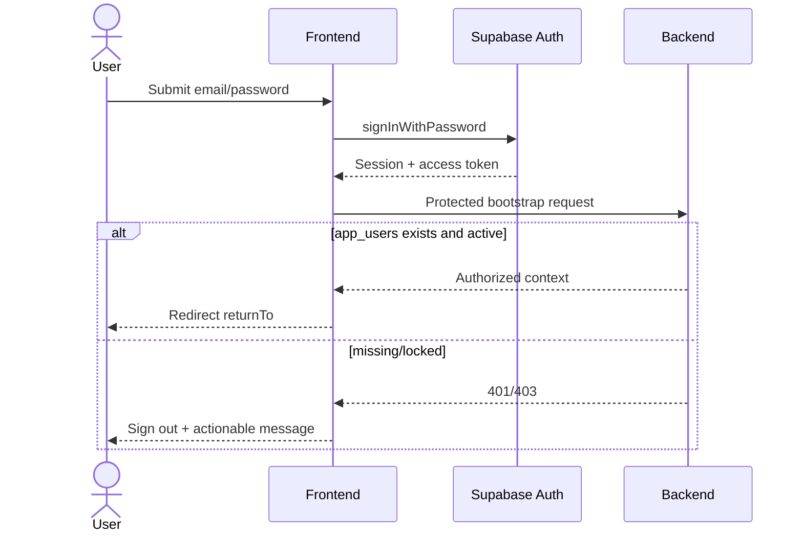
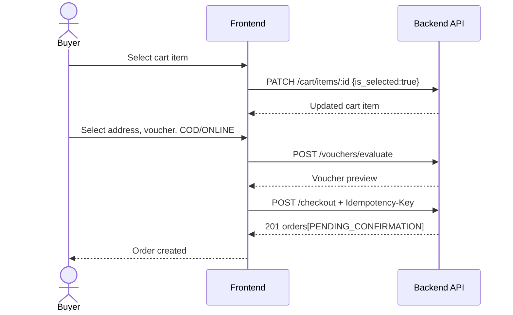
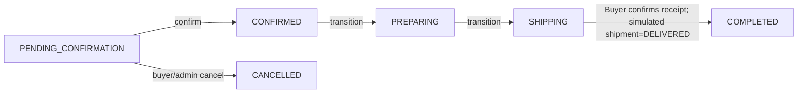

# 02. Pages và user flows

> **Phiên bản:** 1.4.0
>
> **Trạng thái:** ROUTES EXIST — LIVE INTEGRATION SUBJECT TO CAPABILITY READINESS

## 1. Route map

Các route dưới đây là route sản phẩm dự kiến. Đối chiếu source ngày 30/09/2026 trong `frontend/src/app`, toàn bộ route mô tả trong file này đã tồn tại, gồm `/orders/[id]/review`, `/seller/products/new`, `/admin`, `/admin/shops` và `/admin/categories`. Việc route tồn tại không đồng nghĩa capability production đã live; dùng capability registry và readiness matrix thay vì suy từ JSX.

| Route | Role | Data readiness | Strategy |
|---|---|---|---|
| `/` | Public | `LIVE/PARTIAL_DETAIL` | API catalog/category thật; rating chỉ bật sau review read model |
| `/products/[id]` | Public | `PARTIAL` | Core live; media/shop/review read model là task B/C trong file 08 |
| `/cart` | Buyer | `LIVE` | Enriched cart; unavailable rows vẫn hiển thị nhưng không checkout |
| `/checkout` | Buyer | `LIVE` | COD thật, idempotent; không QR/provider giả |
| `/orders` | Buyer | `LIVE/PARTIAL_TIMELINE` | Order reads live; timeline và confirm-received theo C-101–C-106 |
| `/orders/[id]/review` | Buyer | `LIVE/PARTIAL_MEDIA` | Review text/rating dùng API từng OrderItem; live UI không cho chọn ảnh vì runtime reject purpose REVIEW |
| `/notifications` | Buyer | `LIVE/PARTIAL_RELEASE` | Runtime/API nối; authenticated Buyer E2E trên Supabase test pass; host smoke còn mở |
| `/profile` | Authenticated | `LIVE/PARTIAL_RELEASE` | GET/PATCH live; avatar media upload thật, E2E reload pass trên Supabase test |
| `/login` | Public-only | `PARTIAL_PROVIDER` | Source live; bắt buộc provider/env smoke |
| `/register` | Public-only | `PARTIAL_ONBOARDING` | `/auth/onboarding` tồn tại; hoàn thiện Seller PENDING flow |
| `/seller` | Seller | `LIVE/PARTIAL` | Order queue live; stats nằm backlog |
| `/seller/products/new` | Seller | `LIVE/PARTIAL_RELEASE` | Product media upload thật; Seller E2E trên Supabase test pass; Shop phải ACTIVE, host smoke còn mở |
| `/admin` | Admin | `LIVE/PARTIAL` | Users/shops routes live; hardening/audit trong C-401/C-402 |
| `/admin/categories` | Admin | `UI_READY/BLOCKED_RUNTIME` | UI có; local mutation phải thay bằng Admin Category API |

## 2. Quy tắc chung cho page

Mỗi route tải dữ liệu phải có:

- `loading.tsx` hoặc skeleton cục bộ.
- Empty state có CTA phù hợp.
- Error state có retry và hiển thị `request_id` khi có.
- Unauthorized redirect giữ `returnTo` nội bộ an toàn.
- Mutation có pending/disabled state, chống double submit.
- Feature phụ thuộc mock phải hiển thị dev badge trong non-production và bị feature-flag ở production.

## 3. Chi tiết 14 màn hình

### 3.1. Trang chủ `/`

**Mục tiêu:** khám phá và tìm sản phẩm.

**UI:** header/search, hero tĩnh, category filter, product grid, pagination/load more, mobile dock.

**API:** `GET /products?search=&category_id=&sort=&cursor=&limit=`.

**Lưu ý:** category API đã có cho public ACTIVE categories. Không tự sinh UUID. Không hiển thị rating/sold count giả; rating chỉ bật sau C-203/C-205. Add-to-cart nhanh chỉ bật khi item có thể chọn variant; nếu nhiều variant thì đi tới detail.

**Acceptance:** search debounce; URL giữ filter; load more không trùng item; empty/error/retry đầy đủ.

### 3.2. Chi tiết sản phẩm `/products/[id]`

**UI:** tên/mô tả, variant selector, price/stock, quantity, add-to-cart, ảnh placeholder, review placeholder.

**API:** `GET /products/:id`, `POST /cart/items`.

**Behavior:** `stock_quantity=0` vô hiệu CTA. Guest bấm add-to-cart được chuyển login với `returnTo`. “Mua ngay” phải add item rồi set `is_selected=true` trước khi sang checkout.

**Blocker:** API detail chưa có images/shop metadata/reviews. Ẩn “Chat ngay” và “Xem shop” nếu chưa có route.

### 3.3. Giỏ hàng `/cart`

**UI:** item list, quantity, checkbox, delete, summary.

**API:** `GET /cart`, `PATCH /cart/items/:id`, `DELETE /cart/items/:id`.

**Selection:** checkbox gọi `PATCH { is_selected }`; quantity gọi `PATCH { quantity }`. Checkout chỉ bật khi có ít nhất một item selected.

**Runtime:** enriched cart đã trả product/variant/shop/image/current price/stock/availability. Adapter không được fallback fixture khi API lỗi.

### 3.4. Checkout `/checkout`

**Precondition:** Buyer authenticated, có address và cart item `is_selected=true`.

**UI:** address selector dùng danh mục tỉnh/thành + phường/xã 2026, selected items summary, voucher per shop, payment `COD | ONLINE`, phí vận chuyển theo từng shop và total do server báo. Mock estimate phải có nhãn mô phỏng; quote lỗi thì chặn submit và cho thử lại.

**API:** `GET /addresses`, `GET /locations/provinces`, `GET /locations/provinces/:province_code/wards`, `POST /shipping/quote`, `GET /vouchers/applicable`, `POST /vouchers/evaluate`, `POST /checkout`.

**Submit:** tạo và giữ một UUID làm `Idempotency-Key` gắn với snapshot request, gồm quote phí theo shop. Cùng request retry sau timeout/mất mạng phải dùng lại key. Nếu quote trả `SHIPPING_QUOTE_CHANGED`, hiển thị phí mới và yêu cầu buyer xác nhận lại; request xác nhận mới dùng key mới. Nếu đổi địa chỉ, phương thức thanh toán hoặc voucher thì tạo key mới.

**Success:** chuyển `/orders?created=<ids>` hoặc success screen. Không gọi payment retry ngay sau checkout; không hiển thị QR khi backend chưa có provider session.

### 3.5. Đơn hàng `/orders`

**UI:** tabs theo `OrderStatus`, order card, cancel dialog, empty/error.

**API mục tiêu:** `GET /orders`, `GET /orders/:id`, `POST /orders/:id/cancel`.

**Runtime:** list/detail đã có. Phase tiếp theo bổ sung timeline DTO, shipment lifecycle và Buyer confirm-received.

**Cancel:** luôn hỏi reason; sau success refetch list. Chỉ hiển thị nút khi status `PENDING_CONFIRMATION`.

### 3.6. Đánh giá `/orders/[id]/review`

**UI:** danh sách order item chưa review, rating 1–5, content, image attachment preview.

**API mục tiêu:** `POST /order-items/:order_item_id/review`.

**Gate:** route/UI đã có; production submit chỉ bật sau ReviewService runtime, eligibility integration và media capability. Review text/rating có thể làm trước media.

### 3.7. Thông báo `/notifications`

**UI:** filter type/read state, list, mark-one-read.

**API mục tiêu:** `GET /notifications?is_read=`, `PATCH /notifications/:id/read`.

**Gate:** source route có nhưng runtime service cần inject. Không ghi “realtime”. Mark visible thực hiện tối đa 20 request, concurrency 4, có partial rollback và dừng queue khi 429.

### 3.8. Hồ sơ `/profile`

**UI:** avatar, full name, phone, email read-only, address shortcut.

**Data:** `GET/PATCH /profile` là nguồn business profile; Supabase cung cấp email/session. Avatar chờ media capability, còn full name/phone save qua API thật.

### 3.9. Đăng nhập `/login`

**UI:** email, password, show password, forgot-password link chỉ bật nếu flow đã cấu hình.

**Flow:** Supabase `signInWithPassword` → lấy session → gọi một protected lightweight request hoặc session bootstrap để xác nhận `app_users` tồn tại → redirect `returnTo` an toàn.

**Errors:** không tiết lộ email tồn tại hay không; xử lý locked/internal-user-missing riêng.

### 3.10. Đăng ký `/register`

**UI mục tiêu:** email, password, confirm password, full name, account type Buyer/Seller; seller fields chỉ xuất hiện khi onboarding đã được thiết kế.

**Flow:** Supabase signup provision `app_users` Buyer, sau đó `POST /auth/onboarding`. Seller first-time onboarding tạo Shop `PENDING`; Admin approve trước khi Seller mutation. Buyer đã hoàn tất profile nâng cấp Seller nằm ngoài MVP.

### 3.11. Seller portal `/seller`

**UI:** order queue, product/stock table, KPI.

**Available:** `PATCH /product-variants/:id/stock`, order confirm/transition khi biết order ID.

Seller order flow: `CONFIRMED` → `PREPARING` → Seller đánh dấu đã bàn giao (`SHIPPING`). Không có nút seller đánh dấu giao thành công. Buyer xác nhận đã nhận mới hoàn tất đơn.

### 3.12. Tạo sản phẩm `/seller/products/new`

**UI:** basic info, category, trọng lượng gói hàng (gram), media upload thật và variant rows.

**API:** `POST /products` với `stock_quantity`, `variant_name`, `variant_value`, `sort_order`.

**Gate:** dùng category API thật và media presign/finalize theo `media_id`; Shop phải ACTIVE. Production không nhận ảnh fallback/URL demo.

### 3.13. Admin `/admin`

**UI:** users, shops, products, logs tabs.

**Available:** users/shops list và approve/lock/unlock routes. MVP hardening yêu cầu pagination/filter, side effects và atomic audit. Product/review moderation và audit viewer nằm backlog.

### 3.14. Admin categories `/admin/categories`

**UI mục tiêu:** tree/table, create/edit, active toggle.

**Gate:** public category API không đủ cho Admin. C-403/C-405 bổ sung Admin CRUD/status; local create/ID phải bị loại khỏi production.

## 4. User flows

### 4.1. Login

### 4.2. Buyer checkout

### 4.3. Seller fulfillment

Seller phải gọi `PREPARING` sau `CONFIRMED`, rồi mới gọi `SHIPPING` từ `PREPARING`. Seller không được chuyển sang `COMPLETED` hoặc `DELIVERY_FAILED`; UI Seller không hiển thị nút hoàn tất đơn. Order list runtime phải được wire trước khi flow này có thể chạy end-to-end từ UI.

### 4.4. Admin moderation

Admin list users → chọn user → nhập reason → `POST /admin/users/:id/lock|unlock` → refetch list → hiển thị audit result. Hiện bước list/refetch bị blocked, nên flow chỉ hoàn chỉnh sau GAP-ADMIN-READS.
