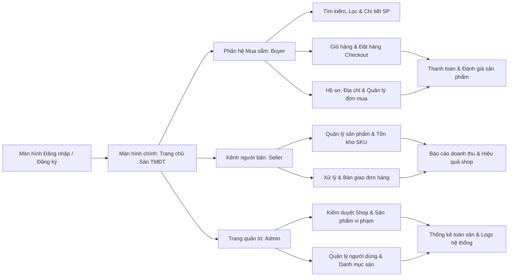

# SƠ ĐỒ ĐIỀU HƯỚNG MÀN HÌNH GIAO DIỆN (UI SITEMAP)
**Dự án:** Nền tảng Thương Mại Điện Tử (E-Commerce Platform) 
**Môn học:** Công nghệ phần mềm — Nhóm 04

> 💡 **Phím tắt xem Preview:** Nhấn **`Ctrl + Shift + V`** (hoặc `Ctrl + K, V`) trong VS Code để xem và chụp lại.

---

## 1. Sơ đồ luồng ngang tổng quan (Chụp nhanh vừa khung hình 16:9)

---

## 2. Sơ đồ chi tiết toàn bộ chức năng (Định dạng Hộp Cam & Xanh lá chuẩn mẫu)

```mermaid
flowchart TB
    %% Định nghĩa màu sắc theo đúng mẫu: Cam cho phân hệ chính, Xanh lá cho chức năng con
    classDef orange fill:#fff7ed,stroke:#ea580c,stroke-width:2px,color:#9a3412,font-weight:bold;
    classDef green fill:#f0fdf4,stroke:#16a34a,stroke-width:1.5px,color:#166534;

    %% Điểm khởi đầu
    HOME["Màn hình chính\n(Trang chủ Sàn TMĐT)"]:::orange
    AUTH["Màn hình Đăng nhập\n& Xác thực tài khoản"]:::orange
    AUTH --> HOME

    %% ------------------- CỤM 1: PHÂN HỆ NGƯỜI MUA (BUYER) -------------------
    subgraph BUYER_GROUP["🛍️ PHÂN HỆ NGƯỜI MUA (BUYER)"]
        direction TB
        BUYER_MAIN["Màn hình Khách hàng"]:::orange

        B_TIM["Tìm kiếm & Lọc sản phẩm"]:::green
        B_XEM["Xem chi tiết & Biến thể SP"]:::green
        B_GIO["Giỏ hàng & Áp mã Voucher"]:::green
        B_DAT["Đặt hàng & Thanh toán Checkout"]:::green
        B_THEO["Theo dõi hành trình đơn hàng"]:::green
        B_DANH["Đánh giá & Bình luận sản phẩm"]:::green
        B_INFO["Hồ sơ & Sổ địa chỉ nhận hàng"]:::green

        BUYER_MAIN --> B_TIM
        BUYER_MAIN --> B_XEM
        BUYER_MAIN --> B_GIO
        BUYER_MAIN --> B_DAT
        BUYER_MAIN --> B_THEO
        BUYER_MAIN --> B_DANH
        BUYER_MAIN --> B_INFO
    end

    %% ------------------- CỤM 2: KÊNH NGƯỜI BÁN (SELLER) -------------------
    subgraph SELLER_GROUP["🛒 KÊNH NGƯỜI BÁN (SELLER)"]
        direction TB
        SELLER_PROD["Quản lý sản phẩm"]:::orange
        SELLER_ORDER["Quản lý bán hàng"]:::orange

        P_ADD["Thêm sản phẩm mới"]:::green
        P_SKU["Quản lý biến thể & SKU"]:::green
        P_STOCK["Cập nhật giá & Tồn kho"]:::green
        P_SEARCH["Tìm kiếm sản phẩm shop"]:::green
        P_DEL["Ẩn / Xóa sản phẩm"]:::green

        O_LIST["Danh sách đơn đặt hàng"]:::green
        O_CONFIRM["Xác nhận đơn hàng"]:::green
        O_PACK["Chuẩn bị & Đóng gói hàng"]:::green
        O_SHIP["Bàn giao đơn vị vận chuyển"]:::green
        O_FIND["Tra cứu đơn & Khách mua"]:::green

        SELLER_PROD --> P_ADD
        SELLER_PROD --> P_SKU
        SELLER_PROD --> P_STOCK
        SELLER_PROD --> P_SEARCH
        SELLER_PROD --> P_DEL

        SELLER_ORDER --> O_LIST
        SELLER_ORDER --> O_CONFIRM
        SELLER_ORDER --> O_PACK
        SELLER_ORDER --> O_SHIP
        SELLER_ORDER --> O_FIND
    end

    %% ------------------- CỤM 3: QUẢN TRỊ VIÊN & THỐNG KÊ (ADMIN) -------------------
    subgraph ADMIN_GROUP["⚙️ QUẢN TRỊ HỆ THỐNG & BÁO CÁO (ADMIN)"]
        direction TB
        ADMIN_MAIN["Quản trị hệ thống"]:::orange
        ADMIN_STAT["Báo cáo & Thống kê"]:::orange

        A_USER["Quản lý tài khoản người dùng"]:::green
        A_SHOP["Quản lý gian hàng (Shop)"]:::green
        A_MOD["Kiểm duyệt sản phẩm vi phạm"]:::green
        A_CAT["Quản lý danh mục sàn"]:::green
        A_LOG["Xem nhật ký quản trị (Logs)"]:::green

        S_REV["Thống kê doanh thu bán hàng"]:::green
        S_ORD["Thống kê tình trạng đơn hàng"]:::green
        S_HOT["Thống kê sản phẩm bán chạy"]:::green
        S_WARN["Báo cáo cảnh báo tồn kho"]:::green

        ADMIN_MAIN --> A_USER
        ADMIN_MAIN --> A_SHOP
        ADMIN_MAIN --> A_MOD
        ADMIN_MAIN --> A_CAT
        ADMIN_MAIN --> A_LOG

        ADMIN_STAT --> S_REV
        ADMIN_STAT --> S_ORD
        ADMIN_STAT --> S_HOT
        ADMIN_STAT --> S_WARN
    end

    %% Kết nối 2 chiều giữa Màn hình chính và các phân hệ
    HOME <--> BUYER_MAIN
    HOME <--> SELLER_PROD
    HOME <--> SELLER_ORDER
    HOME <--> ADMIN_MAIN
    HOME <--> ADMIN_STAT
```

---

## 3. Bảng phân rã cấu trúc màn hình

| STT | Phân hệ chính (Khối Cam) | Màn hình / Chức năng con (Khối Xanh lá) | Mô tả nghiệp vụ |
| :---: | :--- | :--- | :--- |
| **1** | **Màn hình chính** | Trang chủ sàn TMĐT | Banner, danh mục nổi bật, sản phẩm gợi ý, điều hướng các phân hệ. |
| **2** | **Quản lý sản phẩm (Shop)** | • Thêm sản phẩm mới • Quản lý biến thể & SKU • Cập nhật giá & Tồn kho • Tìm kiếm sản phẩm shop • Ẩn / Xóa sản phẩm | Dành cho người bán đăng sản phẩm, thiết lập biến thể màu/size, cập nhật số lượng kho và giá bán. |
| **3** | **Quản lý bán hàng (Shop)** | • Danh sách đơn đặt hàng • Xác nhận đơn hàng • Chuẩn bị & Đóng gói hàng • Bàn giao vận chuyển • Tra cứu đơn / Khách mua | Quản lý vòng đời đơn hàng: xác nhận, chuẩn bị hàng và bàn giao cho đơn vị vận chuyển. |
| **4** | **Báo cáo & Thống kê** | • Thống kê doanh thu • Thống kê đơn hàng • Thống kê SP bán chạy • Báo cáo cảnh báo tồn kho | Thống kê số liệu kinh doanh cho Seller và tổng quan toàn sàn cho Quản trị viên. |
| **5** | **Màn hình người mua (Buyer)** | • Tìm kiếm & Lọc SP • Chi tiết & Biến thể SP • Giỏ hàng & Voucher • Đặt hàng & Checkout • Theo dõi đơn hàng • Đánh giá sản phẩm • Hồ sơ & Sổ địa chỉ | Toàn bộ quy trình trải nghiệm mua sắm của khách hàng từ tìm kiếm tới đặt hàng và nhận xét. |
| **6** | **Quản trị hệ thống (Admin)** | • Quản lý người dùng • Quản lý gian hàng (Shop) • Kiểm duyệt sản phẩm • Quản lý danh mục sàn • Xem nhật ký quản trị (Log) | Quản lý vận hành hệ thống: khóa/mở tài khoản, duyệt shop, xử lý khiếu nại, xem log hệ thống. |
| **7** | **Đăng nhập & Xác thực** | • Đăng nhập tài khoản • Đăng ký tài khoản • Quên / Khôi phục MK • Phân quyền vai trò | Xác thực định danh và phân quyền truy cập theo vai trò (Buyer, Seller, Admin). |
